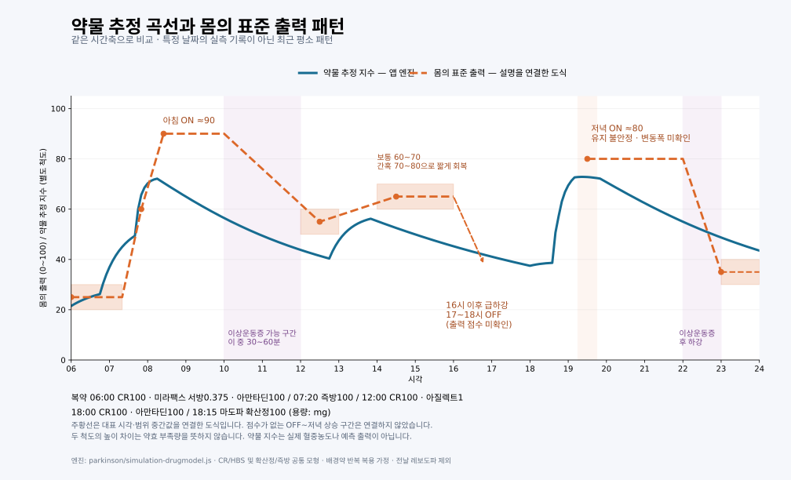

# 내가 하고 싶은 일

*두 번째 그래프를 완성한 후, 내가 나아갈 방향*

지금 나는 오프 상태에 있다. 머릿속에는 하고 싶은 말이 있는데 손가락이 그 말을 따라가지 못한다. 한 글자를 누르려다 같은 글자가 여러 번 찍히고, 문장은 자꾸 끊어진다. 생각은 앞으로 가는데 몸은 그 자리에 머문다. 내가 말하는 ‘출력’의 의미가 이런 순간에 선명해진다. 마음속에 있는 일을 몸으로 얼마나 해낼 수 있는가. 내게 출력은 그런 것이다.

처음 약효일지 앱을 만들 때는 기록하는 습관을 갖고 싶었다. 약을 언제 먹었는지, 언제 몸이 풀렸는지, 어느 순간 다시 걷기 어려워졌는지를 남기고 싶었다. 지나고 나면 하루의 기억은 흐려진다. 힘들었던 순간만 크게 남기도 하고, 잘 걸었던 시간이 얼마나 길었는지는 잊기도 한다. 기록은 그 하루를 다시 들여다볼 수 있게 해 주었다.

그러나 기록이 쌓이면서 다음 질문이 생겼다. 이 자료로 내 몸을 조금 더 이해할 수는 없을까. 언제 좋아졌는지를 넘어, 왜 그때 좋아졌고 왜 다시 나빠졌는지를 알아볼 수는 없을까.

그래서 두 개의 곡선을 그렸다. 하나는 복용한 약이 시간에 따라 작용할 것이라고 추정한 곡선이다. 다른 하나는 내가 몸으로 겪는 출력의 곡선이다. 아직 두 번째 선은 평소의 경험을 옮겨 놓은 도식이지만, 두 선을 겹쳐 보니 하루의 모습이 조금 다르게 보였다.

파란선은 약물 추정 지수, 주황 점선은 내가 설명한 평소 출력 패턴이다. 특정 날짜의 실측 기록은 아니며 두 선의 높이는 서로 다른 척도다.

큰 흐름은 닮아 있었다. 아침에 올라가고, 오후에 내려가고, 저녁에 다시 올라왔다. 하지만 내 몸은 약물 곡선처럼 부드럽게 움직이지 않았다. 한동안 낮은 곳에 머물다가 빠르게 올라갔고, 어렵게 유지하던 출력이 어느 순간 급격히 떨어지기도 했다.

아침에는 즉방약을 먹고 기다리면 비교적 뚜렷하게 몸이 풀린다. 출력을 되찾으면 일을 하고 걸을 수 있다. 오후에는 사정이 다르다. 조금 올라오는 듯하다가 충분한 온에 이르지 못하고, 네 시가 지나면 다시 가파르게 내려간다. 저녁에는 확산정을 먹고 한 시간에서 한 시간 반을 기다려 보행을 회복하지만, 그 온은 어딘가 불안정하다.

움직임이 많다고 기능이 좋은 것도 아니다. 이상운동증이 생기면 몸은 움직이는데, 내가 원하는 움직임은 더 어려워질 수 있다. 내가 알고 싶은 것은 약이 얼마나 강하게 작용하느냐만이 아니다. 그 작용이 내 생활에서 어떤 능력으로 이어지느냐이다.

두 번째 앱에서는 바로 이 관계를 살펴보고 싶다. 첫 번째 앱에 남긴 기록을 가져와 약물 조건과 몸의 반응을 나란히 놓고, 그 사이의 시간차와 반복되는 특징을 찾아보고 싶다. 복용 시각이나 제형, 용량이 달라지면 내 출력선은 어떻게 달라질까. 아침의 시작은 더 일정해질 수 있을까. 오후의 급락은 완만해질 수 있을까. 저녁에는 조금 더 안정적으로 걸을 수 있을까.

물론 두 선이 닮았다고 모든 것을 설명할 수는 없다. 같은 약을 먹어도 잠을 어떻게 잤는지, 식사는 언제 했는지, 그날 몸 상태는 어땠는지에 따라 결과가 달라질 수 있다. 내가 기대한 대로 움직인 날뿐 아니라, 예상과 어긋난 날도 남겨야 한다. 바꾸기 전에 예상한 결과와 바꾼 뒤 실제로 나타난 결과를 비교해야 한다. 내 생각을 확인하는 데 그치지 않고, 틀린 생각을 고칠 수 있어야 한다.

내가 바라는 하루는 특별하지 않다. 아침에 일을 시작할 수 있고, 오후에 갑자기 몸이 굳을까 덜 걱정하며, 저녁에는 걷고 식사하고 쉴 수 있는 하루다. 하루 종일 가장 높은 출력을 유지하는 것보다, 필요한 순간에 몸을 쓸 수 있고 그 상태가 조금 더 안정적으로 이어지기를 바란다.

지금 화면에 있는 두 번째 그래프는 그 방향으로 가기 위한 출발점이다. 앞으로 실제 기록이 더해지고, 예상과 결과를 비교하는 시간이 쌓이면 이 선은 내 몸을 조금 더 잘 설명하게 될지도 모른다. 어디까지 예측할 수 있고 어디부터 어려운지도 알게 될 것이다.

나는 지금도 문장을 쓰다가 멈춘다. 손가락이 말을 따라오지 않아 누군가의 도움을 빌려 생각을 남긴다. 오늘처럼 글을 쓰고 싶은데 쓰기 어려운 순간이 있기에, 이 일을 계속하고 싶다.

내가 하고 싶은 일은 내 몸의 변화를 이해하고, 그 이해를 바탕으로 내가 할 수 있는 시간을 조금씩 넓혀 가는 것이다. 두 번째 그래프를 그린 뒤, 내가 나아가고 싶은 방향은 그곳이다.
